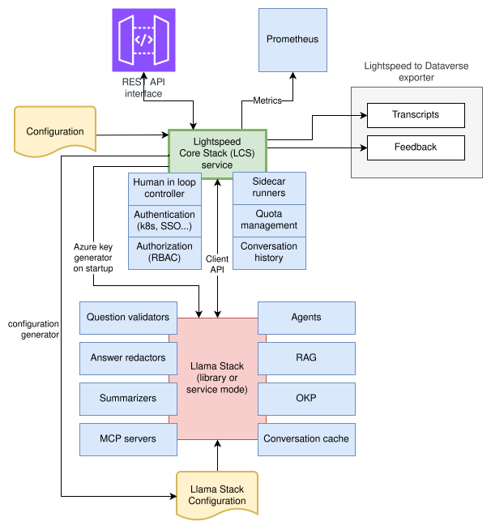

# Overview

## Introduction

### What is Lightspeed Core Stack?

**Lightspeed Core Stack (LCore)** is an enterprise-grade middleware service that provides a robust layer between client applications and AI Large Language Model (LLM) backends. It adds essential enterprise features such as authentication, authorization, quota management, caching, and observability to LLM interactions.

Current version of LCore is built on **OGX (Llama Stack)** - open-source framework that provides standardized APIs for building LLM applications. OGX offers a unified interface for models, RAG (vector stores), and tools across different providers. LCore communicates with OGX to orchestrate all LLM operations.

To enhance LLM responses, LCore leverages **RAG (Retrieval-Augmented Generation)**, which retrieves relevant context from vector databases before generating answers. OGX manages the vector stores, and LCore queries them to inject relevant documentation, knowledge bases, or previous conversations into the LLM prompt.

LCore also provides **safety shields** such as topic validation and PII redaction. These are configured in LCore and applied on request endpoints before or during agent processing.

### Key Features

- **Multi-Provider Support**: Works with multiple LLM providers (Ollama, OpenAI, Watsonx, etc.)
- **Enterprise Security**: Authentication, authorization (RBAC), and secure credential management
- **Resource Management**: Token-based quota limits and usage tracking
- **Conversation Management**: Multi-turn conversations with history and caching
- **RAG Integration**: Retrieval-Augmented Generation for context-aware responses
- **Tool Orchestration**: Model Context Protocol (MCP) server integration
- **Observability**: Prometheus metrics, structured logging, and health checks
- **Agent-to-Agent**: A2A protocol support for multi-agent collaboration

### Components Overview

