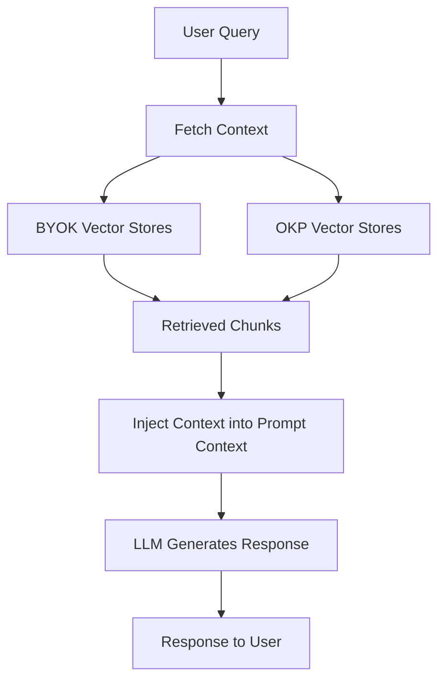
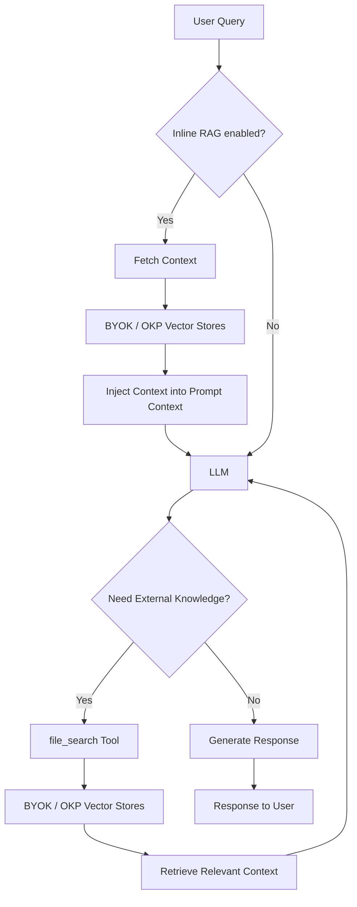

# BYOK (Bring Your Own Knowledge) Feature Documentation

## Overview

The BYOK (Bring Your Own Knowledge) feature in Lightspeed Core enables users to integrate their own knowledge sources into the AI system through Retrieval-Augmented Generation (RAG) functionality. This feature allows the AI to access and utilize custom knowledge bases to provide more accurate, contextual, and domain-specific responses.

---

## Table of Contents

* [What is BYOK?](#what-is-byok)
* [How BYOK Works](#how-byok-works)
* [Prerequisites](#prerequisites)
* [Configuration Guide](#configuration-guide)
  * [Step 1: Prepare Your Knowledge Sources](#step-1-prepare-your-knowledge-sources)
  * [Step 2: Create Vector Database](#step-2-create-vector-database)
  * [Step 3: Configure Embedding Model](#step-3-configure-embedding-model)
  * [Step 4: Configure BYOK Knowledge Sources](#step-4-configure-byok-knowledge-sources)
  * [Step 5: Configure RAG Strategy](#step-5-configure-rag-strategy)
* [Supported Vector Database Types](#supported-vector-database-types)
* [Configuration Examples](#configuration-examples)
* [Conclusion](#conclusion)

---

## What is BYOK?

BYOK (Bring Your Own Knowledge) is Lightspeed Core's implementation of Retrieval-Augmented Generation (RAG) that allows you to:

- **Integrate custom knowledge sources**: Add your organization's documentation, manuals, FAQs, or any text-based knowledge
- **Enhance AI responses**: Provide contextual, accurate answers based on your specific domain knowledge
- **Maintain data control**: Keep your knowledge sources within your infrastructure
- **Improve relevance**: Get responses that are tailored to your organization's context and terminology

## How BYOK Works

BYOK knowledge sources can be queried in two complementary modes, configured independently:

### Inline RAG

Context is fetched from your BYOK vector stores and/or OKP and injected before the LLM request. No tool calls are required.



### Tool RAG (on-demand retrieval)

The LLM can call the `file_search` tool during generation when it decides external knowledge is needed. Both BYOK vector stores and OKP are supported in Tool RAG mode.



Both modes rely on:
- **Vector Database**: Your indexed knowledge sources stored as vector embeddings
- **Embedding Model**: Converts queries and documents into vector representations for similarity matching

Inline RAG additionally supports:
- **Score Multiplier**: Optional weight applied per BYOK vector store when mixing multiple sources. Allows custom prioritization of content.

> [!NOTE]
> OKP and BYOK scores are not directly comparable (different scoring systems), so
> `score_multiplier` does not apply to OKP results. To control the amount of retrieved
> context, set the `BYOK_RAG_MAX_CHUNKS` and `OKP_RAG_MAX_CHUNKS` constants in `src/constants.py`
> (defaults: 10 and 5 respectively). For Tool RAG, use `TOOL_RAG_MAX_CHUNKS` (default: 10).
> The `INLINE_RAG_MAX_CHUNKS` constant (value: 10) caps the final merged inline RAG
> chunks (BYOK + OKP) delivered to the LLM. Tool RAG is controlled independently
> by `TOOL_RAG_MAX_CHUNKS`.

---

## Prerequisites

Before implementing BYOK, ensure you have:

### Required Tools
- **rag-content tool**: For creating compatible vector databases
  - Repository: https://github.com/lightspeed-core/rag-content
  - Used for indexing your knowledge sources

### System Requirements
- **Embedding Model**: Local or downloadable embedding model
- **LLM Provider**: OpenAI, vLLM, or other supported inference provider

### Knowledge Sources
- **Directly supported**: Markdown (`.md`), plain text (`.txt`), PDF (`.pdf`), and HTML (`.html`/`.htm`) files. PDF and HTML are converted to Markdown automatically by [`rag-content`](https://github.com/lightspeed-core/rag-content) (via docling) — no manual pre-conversion step is needed. See the rag-content README's [Supported Input Formats](https://github.com/lightspeed-core/rag-content#supported-input-formats) section.
- **Requires conversion**: AsciiDoc and other formats must be converted to Markdown or plain text first.
- Documentation, manuals, FAQs, knowledge bases

---

## Configuration Guide

### Step 1: Prepare Your Knowledge Sources

1. **Collect your documents**: Gather all knowledge sources you want to include
2. **Markdown, text, PDF, and HTML ingest directly**: Place `.md`, `.txt`, `.pdf`, and `.html` files in your input directory and pass them to `rag-content` with the matching document type (`-t pdf` or `-t html`). `rag-content` converts PDF and HTML to Markdown for you via docling — no manual pre-conversion step is required.
   - **PDF note**: Scanned / image-only PDFs are out of scope (OCR is disabled); they index as empty and `rag-content` logs a warning naming the file. Run such PDFs through a separate OCR step first.
   - **AsciiDoc and other formats**: Convert to Markdown or plain text first — e.g. use [custom scripts](https://github.com/openshift/lightspeed-rag-content/blob/main/scripts/asciidoctor-text/convert-it-all.py) for AsciiDoc.
3. **Organize content**: Structure your documents for optimal indexing

### Step 2: Create Vector Database

Use the `rag-content` tool to create a compatible vector database:
Please refer https://github.com/lightspeed-core/rag-content to create your vector database

**Metadata Configuration:**
When using the `rag-content` tool, you need to create a `custom_processor.py` script to handle document metadata:

1. **Document URL References**: Implement the `url_function` in your `custom_processor.py` to add URL metadata to each document chunk
2. **Title Extraction**: The system automatically extracts the document title from the first line of each file
3. **Custom Metadata**: You can add additional metadata fields as needed for your use case

Example `custom_processor.py` structure:
```python
class CustomMetadataProcessor(MetadataProcessor):

    def __init__(self, url):
        self.url = url

    def url_function(self, file_path: str) -> str:
        # Return a URL for the file, so it can be referenced when used
        # in an answer
        return self.url
```

**Important Notes:**
- Supported formats: 
  - Faiss Vector-IO
- **The embedding model (and its dimension) used to *build* the vector store must exactly match the one configured for querying** in the `byok_rag` section (see Step 3). A mismatch does not raise an error — it silently returns no or irrelevant results, because the query vector and the stored vectors are then incomparable. The default is `sentence-transformers/all-mpnet-base-v2` (dimension `768`).

### Step 3: Configure Embedding Model

You have two options for obtaining your embedding model:

#### Option 1: Use rag-content Download Script (Optional)
You can use the embedding generation step mentioned in the rag-content repo:

```bash
mkdir ./embeddings_model
uv run python ./scripts/download_embeddings_model.py -l ./embeddings_model/ -r sentence-transformers/all-mpnet-base-v2
```

#### Option 2: Manual Download and Configuration
Alternatively, you can download your own embedding model and update the path in your YAML configuration:

1. **Download your preferred embedding model** from Hugging Face or other sources
2. **Place the model** in your desired directory (e.g., `/path/to/your/embedding_models/`)

The embedding model is specified per knowledge source in the `byok_rag` section of `lightspeed-stack.yaml` via the `embedding_model` field. The default is `sentence-transformers/all-mpnet-base-v2` with a dimension of `768`.

**Note**: Ensure the same embedding model is used for both vector database creation and querying.

### Step 4: Configure BYOK Knowledge Sources

Declare your knowledge sources in the `byok_rag` section of your `lightspeed-stack.yaml`. The required configuration is automatically generated at startup when using `make run`, `make run-stack`, `docker-compose`, or library mode.

```yaml
byok_rag:
  - rag_id: my-docs                                    # Unique identifier for this knowledge source
    rag_type: inline::faiss                             # Vector store type (default: inline::faiss)
    embedding_model: sentence-transformers/all-mpnet-base-v2  # Embedding model (default)
    embedding_dimension: 768                            # Must match your embedding model's output
    vector_db_id: vs_8c94967b-81cc-4028-a294-9cfac6fd9ae2                              # Generated by rag-content during index creation
    db_path: /path/to/vector_db/faiss_store.db          # Path to the vector database file
    score_multiplier: 1.0                               # Weight for Inline RAG result ranking (default: 1.0)
```

**Common fields (all providers):**

| Field                 | Required | Default                                   | Description                                                                               |
|-----------------------|----------|-------------------------------------------|-------------------------------------------------------------------------------------------|
| `rag_id`              | Yes      | —                                         | Unique identifier for the knowledge source                                                |
| `rag_type`            | No       | `inline::faiss`                           | Vector store provider type (`inline::faiss` or `remote::pgvector`)                        |
| `embedding_model`     | No       | `sentence-transformers/all-mpnet-base-v2` | Embedding model identifier or path                                                        |
| `embedding_dimension` | No       | `768`                                     | Embedding vector dimensionality                                                           |
| `vector_db_id`        | Yes      | —                                         | Vector store ID generated by rag-content (e.g. `vs_8c94967b-81cc-4028-a294-9cfac6fd9ae2`) |
| `score_multiplier`    | No       | `1.0`                                     | Weight for Inline RAG ranking (values > 1.0 boost; < 1.0 reduce)                          |

**FAISS fields** (`rag_type: inline::faiss`):

| Field     | Required | Default | Description                      |
|-----------|----------|---------|----------------------------------|
| `db_path` | Yes      | —       | Path to the vector database file |

**pgvector fields** (`rag_type: remote::pgvector`):

| Field      | Required | Default                  | Description         |
|------------|----------|--------------------------|---------------------|
| `host`     | No       | `${env.POSTGRES_HOST}`   | PostgreSQL host     |
| `port`     | No       | `${env.POSTGRES_PORT}`   | PostgreSQL port     |
| `db`       | No       | `${env.POSTGRES_DATABASE}` | PostgreSQL database |
| `user`     | No       | `${env.POSTGRES_USER}`   | PostgreSQL user     |
| `password` | No       | `${env.POSTGRES_PASSWORD}` | PostgreSQL password |

**Multiple knowledge sources:**

You can configure multiple BYOK sources. When using Inline RAG, `score_multiplier` adjusts the relative importance of each store's results:

```yaml
byok_rag:
  - rag_id: ocp-docs
    rag_type: inline::faiss
    embedding_model: sentence-transformers/all-mpnet-base-v2
    embedding_dimension: 768
    vector_db_id: vs_3a7f9b2e-45dc-4e1a-b8f2-1c9d0e3f5a6b
    db_path: /data/vector_dbs/ocp_docs/faiss_store.db
    score_multiplier: 1.0

  - rag_id: internal-kb
    rag_type: inline::faiss
    embedding_model: sentence-transformers/all-mpnet-base-v2
    embedding_dimension: 768
    vector_db_id: vs_d4c8e1f0-92ab-4d3c-a5e7-6b8f0c2d1e3a
    db_path: /data/vector_dbs/internal_kb/faiss_store.db
    score_multiplier: 1.2       # Boost results from this store
```

**⚠️ Important**: The `vector_db_id` value must exactly match the ID generated by the rag-content tool during index creation (e.g. `vs_8c94967b-81cc-4028-a294-9cfac6fd9ae2`). This identifier links your configuration to the specific vector database index.

### Step 5: Configure RAG Strategy

Add a `rag` section to your `lightspeed-stack.yaml` to choose how BYOK knowledge is used.
Each list entry is a `rag_id` from `byok_rag`, or the special value `okp` for OKP.

```yaml
rag:
  # Inline RAG: inject context before the LLM request (no tool calls needed)
  inline:
    - my-docs         # rag_id from byok_rag
    - okp             # include OKP context inline

  # Tool RAG: the LLM can call file_search to retrieve context on demand
  # If omitted, tool RAG is disabled. If both tool and inline are omitted, all registered stores are used as fallback
  tool:
    - my-docs         # expose this BYOK store as the file_search tool
    - okp             # expose OKP as the file_search tool

# OKP provider settings (only relevant when okp is listed above)
okp:
  offline: true       # true = use parent_id for source URLs, false = use reference_url
```

Both modes can be enabled simultaneously. Choose based on your latency and control preferences:

| Mode       | When context is fetched | Tool call needed | score_multiplier |
|------------|-------------------------|------------------|------------------|
| Inline RAG | With every query        | No               | Yes (BYOK only)  |
| Tool RAG   | On LLM demand           | Yes              | No               |

> [!TIP]
> A ready-to-use example combining BYOK and OKP is available at
> [`examples/lightspeed-stack-byok-okp-rag.yaml`](../examples/lightspeed-stack-byok-okp-rag.yaml).

---

## Supported Vector Database Types

### 1. FAISS (Recommended)
- **Type**: Local vector database with SQLite metadata
- **Best for**: Small to medium-sized knowledge bases
- **Configuration**: `rag_type: inline::faiss`
- **Storage**: SQLite database file

```yaml
byok_rag:
  - rag_id: faiss-knowledge
    rag_type: inline::faiss
    embedding_model: sentence-transformers/all-mpnet-base-v2
    embedding_dimension: 768
    vector_db_id: vs_8c94967b-81cc-4028-a294-9cfac6fd9ae2
    db_path: /path/to/faiss_store.db
```

### 2. pgvector (PostgreSQL)
- **Type**: PostgreSQL with pgvector extension
- **Best for**: Large-scale deployments, shared knowledge bases
- **Configuration**: `rag_type: remote::pgvector`
- **Requirements**: PostgreSQL with pgvector extension

```yaml
byok_rag:
  - rag_id: pgvector-knowledge
    rag_type: remote::pgvector
    embedding_model: sentence-transformers/all-mpnet-base-v2
    embedding_dimension: 768
    vector_db_id: rhdocs
    host: ${env.POSTGRES_HOST}
    port: ${env.POSTGRES_PORT}
    db: ${env.POSTGRES_DATABASE}
    user: ${env.POSTGRES_USER}
    password: ${env.POSTGRES_PASSWORD}
```

> [!NOTE]
> Connection fields (`host`, `port`, `db`, `user`, `password`) default to
> `${env.POSTGRES_*}` environment variable references when omitted.

**pgvector Table Schema:**
- `id` (text): UUID identifier of the chunk
- `document` (jsonb): JSON containing content and metadata
- `embedding` (vector(n)): The embedding vector (n = embedding dimension)

---

## Configuration Examples

### Example 1: FAISS Knowledge Base

A minimal `lightspeed-stack.yaml` configuration with a FAISS-based BYOK knowledge source:

```yaml
name: Lightspeed Core Service (LCS)
service:
  host: localhost
  port: 8080
  auth_enabled: false

byok_rag:
  - rag_id: company-docs
    rag_type: inline::faiss
    embedding_model: sentence-transformers/all-mpnet-base-v2
    embedding_dimension: 768
    vector_db_id: vs_f1a2b3c4-56de-4f78-90ab-cdef12345678
    db_path: /home/user/vector_dbs/company_docs/faiss_store.db

rag:
  inline:
    - company-docs
  tool:
    - company-docs
```

### Example 2: Multiple Knowledge Sources with pgvector

A configuration combining a local FAISS store with a remote pgvector store:

```yaml
name: Lightspeed Core Service (LCS)
service:
  host: localhost
  port: 8080
  auth_enabled: false

byok_rag:
  - rag_id: local-docs
    rag_type: inline::faiss
    embedding_model: sentence-transformers/all-mpnet-base-v2
    embedding_dimension: 768
    vector_db_id: vs_e9d8c7b6-43af-4b2d-8e1f-0a9b8c7d6e5f
    db_path: /data/vector_dbs/local/faiss_store.db
    score_multiplier: 1.0
  - rag_id: enterprise-kb
    rag_type: remote::pgvector
    embedding_model: sentence-transformers/all-mpnet-base-v2
    embedding_dimension: 768
    vector_db_id: enterprise_docs
    host: ${env.POSTGRES_HOST}
    port: ${env.POSTGRES_PORT}
    db: ${env.POSTGRES_DATABASE}
    user: ${env.POSTGRES_USER}
    password: ${env.POSTGRES_PASSWORD}

rag:
  inline:
    - local-docs
    - enterprise-kb
  tool:
    - local-docs
    - enterprise-kb
```

> [!NOTE]
> For pgvector, ensure your PostgreSQL credentials are available via environment variables
> (e.g., `POSTGRES_HOST`, `POSTGRES_PASSWORD`).

> [!TIP]
> A complete working example combining BYOK and OKP is available at
> [`examples/lightspeed-stack-byok-okp-rag.yaml`](../examples/lightspeed-stack-byok-okp-rag.yaml).

---

## Conclusion

The BYOK (Bring Your Own Knowledge) feature in Lightspeed Core provides powerful capabilities for integrating custom knowledge sources through RAG technology. By following this guide, you can successfully implement and configure BYOK to enhance your AI system with domain-specific knowledge.

For additional support and advanced configurations, refer to:
- [RAG Configuration Guide](rag_guide.md)
- [rag-content Tool Repository](https://github.com/lightspeed-core/rag-content)

Remember to regularly update your knowledge sources and monitor system performance to maintain optimal BYOK functionality.
